```{r setup, include=FALSE}
knitr::opts_chunk$set(
  echo      = TRUE,
  message   = FALSE,
  warning   = FALSE,
  fig.align = "center"
)
```

```{r packages}
library(readxl)
library(purrr)
library(dplyr)
library(DT)
library(gt)
```


```{r load-tables}
# ── Load all result tables from the exported Excel workbook ──────────────────
xlsx_path <- "figs/R/PanelCheck_results.xlsx"

table_names <- c(
  "descriptive_stats",
  "descriptive_stats_overall",
  "Table5_perf_counts",
  "Table6_anova_Fratios",
  "panel_performance",
  "assessor_discrimination",
  "assessor_agreement",
  "panel_anova",
  "repeatability_anova",
  "mixed_model_fixed",
  "mixed_model_random",
  "tukey_contrasts",
  "tukey_cld",
  "tukey_emmeans",
  "pca_sample_coords",
  "pca_variable_coords"
)

tables <- map(table_names, \(t) read_xlsx(xlsx_path, sheet = t))
names(tables) <- table_names
```

---

# Introduction

This report presents the outputs of the **PanelCheck R translation** — a clean, modular reimplementation of the PanelCheck sensory panel analysis pipeline in R. All analyses were executed via `R/run_all.R` on the included example dataset (`Data_Bread.xlsx`), which comprises ratings from **8 assessors** across **5 bread samples**, collected over **2 replicates** and **10 sensory attributes**.

The analyses cover four broad areas:

| Area | Scripts |
|------|---------|
| Panel performance & ANOVA | `01_panel_performance.R` |
| Profile visualisation | `02_profile_plots.R`, `05_fvalue_overview.R` |
| Mixed model & post-hoc testing | `03_mixed_model.R` |
| Consensus PCA | `04_pca.R` |

Tabular results are loaded directly from `figs/R/PanelCheck_results.xlsx`; figures are embedded from `figs/R/`.

---

# Descriptive Statistics {.tabset}

Descriptive statistics summarise the distribution of sensory scores across all attributes. The **by-sample** table breaks scores down per product, whilst the **overall** table collapses across samples to give panel-wide summaries.

## By Sample

Each row represents one attribute–sample combination. Columns report the minimum, maximum, mean, standard deviation (SD), standard error of the mean (SEM), and coefficient of variation (CV%).

```{r desc-by-sample}
tables[["descriptive_stats"]] |>
  mutate(across(where(is.numeric), \(x) round(x, 2))) |>
  datatable(
    filter    = "top",
    rownames  = FALSE,
    extensions = "Buttons",
    options   = list(
      dom        = "Bfrtip",
      buttons    = c("csv", "excel"),
      pageLength = 15,
      scrollX    = TRUE
    ),
    caption = "Table 1. Descriptive statistics per attribute and sample."
  )
```

## Overall

Panel-wide descriptive statistics collapsed across all samples and replicates.

```{r desc-overall}
tables[["descriptive_stats_overall"]] |>
  mutate(across(where(is.numeric), \(x) round(x, 2))) |>
  datatable(
    filter    = "top",
    rownames  = FALSE,
    extensions = "Buttons",
    options   = list(
      dom        = "Bfrtip",
      buttons    = c("csv", "excel"),
      pageLength = 15,
      scrollX    = TRUE
    ),
    caption = "Table 2. Overall descriptive statistics per attribute."
  )
```

---

# Panel Performance {.tabset}

Panel performance is evaluated per assessor and attribute using three complementary metrics:

- **Discrimination** — ability to distinguish between samples (F-value from one-way ANOVA per assessor)
- **Repeatability** — consistency across replicates (CV%)
- **Agreement** — correlation of individual scores with the panel mean

## Summary Table

The panel performance table combines all three metrics into a single summary per assessor and attribute. Higher discrimination F-values and agreement correlations, combined with lower repeatability CVs, indicate a well-performing assessor.

```{r panel-perf}
tables[["panel_performance"]] |>
  mutate(across(where(is.numeric), \(x) round(x, 2))) |>
  datatable(
    filter    = "top",
    rownames  = FALSE,
    extensions = "Buttons",
    options   = list(
      dom        = "Bfrtip",
      buttons    = c("csv", "excel"),
      pageLength = 15,
      scrollX    = TRUE
    ),
    caption = "Table 3. Combined panel performance metrics per assessor and attribute."
  )
```

## Performance Counts

The counts table summarises how many attributes each assessor performs well, moderately, or poorly on — providing a quick overview of overall panel reliability.

```{r perf-counts}
tables[["Table5_perf_counts"]] |>
  gt() |>
  tab_header(
    title    = "Table 4. Panel Performance Count Summary",
    subtitle = "Number of attributes per assessor meeting performance thresholds"
  ) |>
  tab_spanner_delim(delim = "_") |>
  fmt_number(decimals = 2) |>
  opt_row_striping() |>
  opt_table_font(font = google_font("Source Sans Pro")) |>
  tab_options(
    table.font.size    = px(13),
    heading.align      = "left",
    column_labels.font.weight = "bold"
  )
```

## Mean Score Plot

The panel mean score plot displays the average rating for each sample across all attributes, providing an at-a-glance view of product differentiation at the panel level.

```{r panel-mean-fig, out.width="90%"}
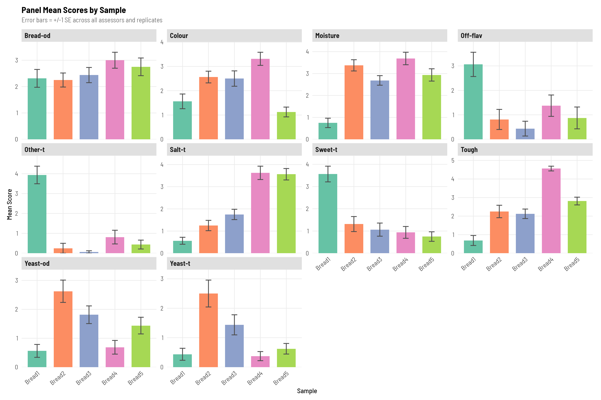
```

---

# Assessor Discrimination {.tabset}

Discrimination is assessed via a one-way ANOVA per assessor per attribute. The resulting F-value indicates how well each assessor distinguishes between samples on that attribute — a higher F-value reflects stronger discrimination.

## Discrimination Table

```{r discrimination-table}
tables[["assessor_discrimination"]] |>
  mutate(across(where(is.numeric), \(x) round(x, 2))) |>
  datatable(
    filter    = "top",
    rownames  = FALSE,
    extensions = "Buttons",
    options   = list(
      dom        = "Bfrtip",
      buttons    = c("csv", "excel"),
      pageLength = 15,
      scrollX    = TRUE
    ),
    caption = "Table 5. One-way ANOVA F-values per assessor and attribute."
  )
```

<small>*Significance key:* `***` p < 0.001 · `**` p < 0.01 · `*` p < 0.05 · `ns` p ≥ 0.05</small>

## Discrimination Bars

Each bar represents an assessor's F-value for a given attribute. Bar colour reflects the significance of the one-way ANOVA for that assessor–attribute combination.

```{r discrimination-bars, out.width="90%"}
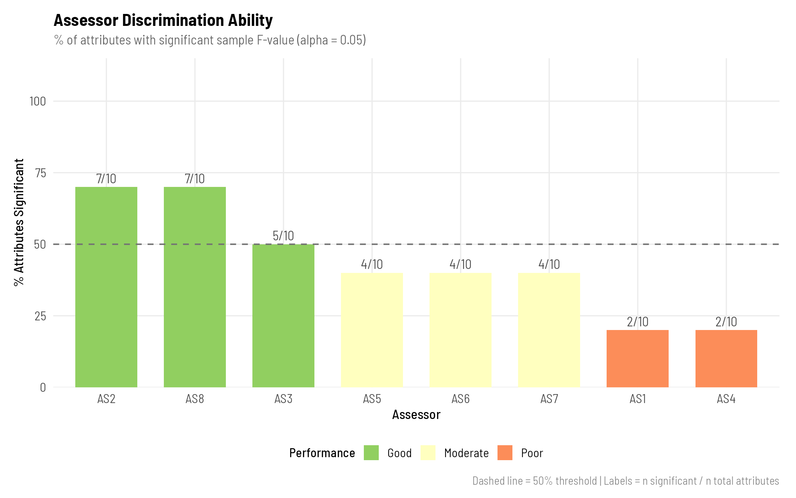
```

---

# Panel ANOVA {.tabset}

A three-way fixed-effects ANOVA is run per attribute at the panel level using `lm()` with sum-to-zero contrasts and `car::Anova()` (Type III sums of squares). All three structural terms — Sample, Assessor, and Replicate — are treated as **fixed effects** (contrast with the mixed model below, where Assessor is random). Type III SS with sum-to-zero contrasts ensures correct marginal F-tests for unbalanced designs. This decomposes variance into the following effects:

- **Sample** — significant product differences (the primary goal of profiling)
- **Assessor** — systematic differences in scale use between panellists
- **Replicate** — variation between repeat sessions; a significant effect indicates poor panel repeatability
- **Sample × Assessor** — interaction indicating disagreement in how assessors rank samples relative to one another (included only when all assessor × sample cells are observed; dropped automatically for incomplete designs)

F-ratios are computed as the marginal mean square for each effect divided by the residual mean square. Significance is evaluated against an F-distribution with the corresponding degrees of freedom.

## ANOVA F-Ratios

```{r anova-fratios}
tables[["Table6_anova_Fratios"]] |>
  mutate(across(where(is.numeric), \(x) round(x, 2))) |>
  datatable(
    filter    = "top",
    rownames  = FALSE,
    extensions = "Buttons",
    options   = list(
      dom        = "Bfrtip",
      buttons    = c("csv", "excel"),
      pageLength = 15,
      scrollX    = TRUE
    ),
    caption = "Table 6. Three-way fixed-effects ANOVA F-ratios per attribute (wide format). Each cell shows the rounded F-ratio and significance stars for the Sample, Panellist, and Replicate main effects. See Table 7 for full SS, df, MS, and interaction term detail."
  )
```

<small>*Significance key:* `***` p < 0.001 · `**` p < 0.01 · `*` p < 0.05 · `ns` p ≥ 0.05</small>

## Panel ANOVA Detail

```{r panel-anova-detail}
tables[["panel_anova"]] |>
  mutate(across(where(is.numeric), \(x) round(x, 2))) |>
  datatable(
    filter    = "top",
    rownames  = FALSE,
    extensions = "Buttons",
    options   = list(
      dom        = "Bfrtip",
      buttons    = c("csv", "excel"),
      pageLength = 15,
      scrollX    = TRUE
    ),
    caption = "Table 7. Three-way fixed-effects ANOVA results in long format — one row per effect, reporting SS, df, MS, F, and p per attribute. Includes the Sample × Assessor interaction where design is complete."
  )
```

<small>*Significance key:* `***` p < 0.001 · `**` p < 0.01 · `*` p < 0.05 · `ns` p ≥ 0.05</small>

## F-Value Heatmap

The heatmap displays F-values for each effect (rows) across all attributes (columns). Warm colours indicate higher F-values and stronger effects.

```{r fvalue-heatmap, out.width="90%"}
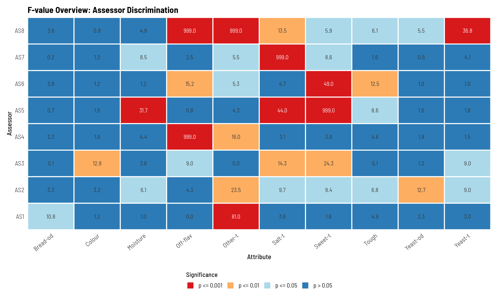
```

## F-Value Dotplot

The dotplot provides an alternative view of the same F-values, ordered by magnitude per effect, making it easier to identify the most discriminating attributes.

```{r fvalue-dotplot, out.width="90%"}
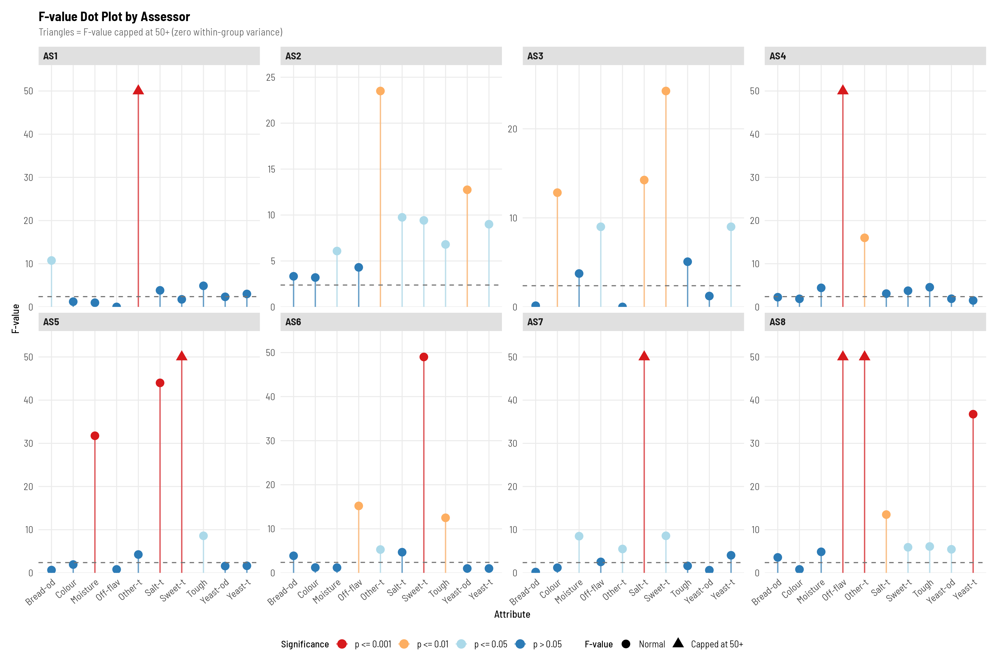
```

## P-Value Heatmap

The p-value heatmap highlights which attribute–effect combinations are statistically significant. Each cell is labelled with a significance symbol derived from the three-way fixed-effects ANOVA p-value for that attribute × effect combination.

```{r pvalue-heatmap, out.width="90%"}
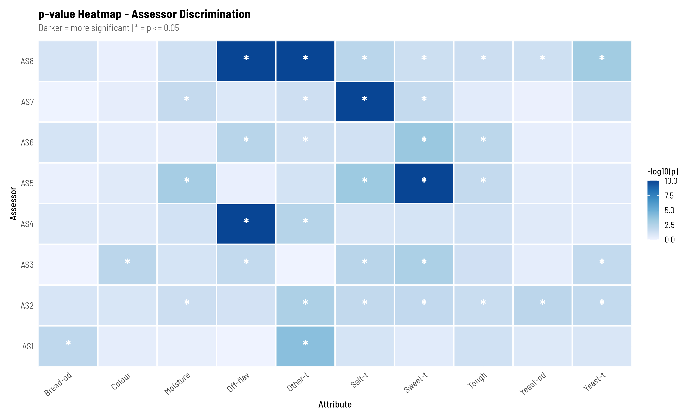
```

## Panel ANOVA F-Values Plot

```{r panel-anova-fvalues, out.width="90%"}
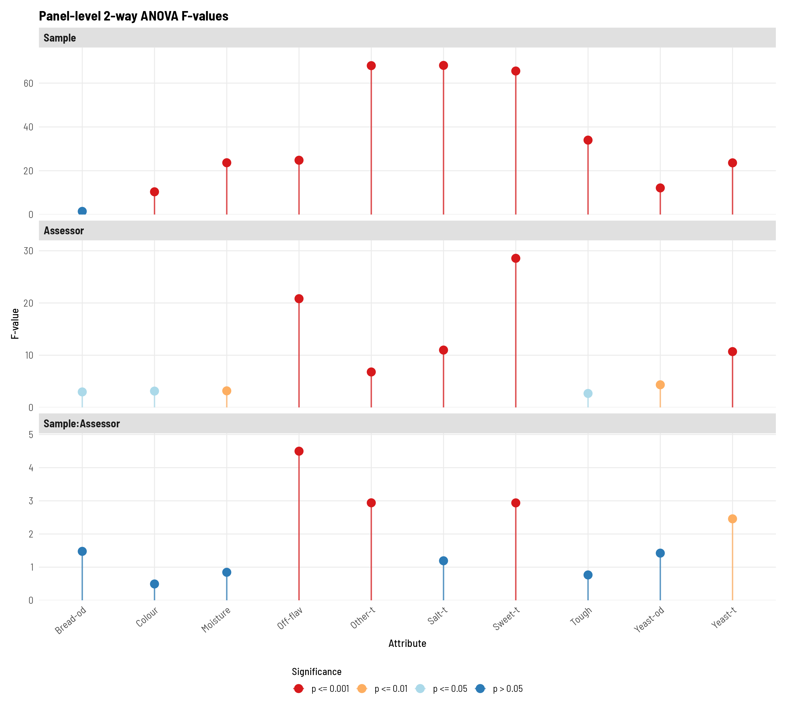
```

---

# Repeatability & Agreement {.tabset}

## Repeatability ANOVA

Repeatability is evaluated using a two-way additive fixed-effects ANOVA (value ~ Sample + Replicate, Type III SS) fitted separately for each assessor × attribute combination. No Sample × Replicate interaction is included — with typically only two replicates this term cannot be estimated reliably. A significant **Sample** effect confirms the assessor discriminates between products; a significant **Replicate** effect indicates session-to-session inconsistency (poor repeatability).

```{r repeatability}
tables[["repeatability_anova"]] |>
  mutate(across(where(is.numeric), \(x) round(x, 2))) |>
  datatable(
    filter    = "top",
    rownames  = FALSE,
    extensions = "Buttons",
    options   = list(
      dom        = "Bfrtip",
      buttons    = c("csv", "excel"),
      pageLength = 15,
      scrollX    = TRUE
    ),
    caption = "Table 8. Repeatability ANOVA results per assessor and attribute, reporting F and p for the Sample and Replicate effects."
  )
```

<small>*Significance key:* `***` p < 0.001 · `**` p < 0.01 · `*` p < 0.05 · `ns` p ≥ 0.05</small>

## Assessor Agreement

Agreement is quantified as the Pearson correlation between each assessor's scores and the panel mean. Values approaching 1 indicate the assessor aligns closely with the consensus; values near 0 or negative indicate systematic disagreement.

```{r agreement}
tables[["assessor_agreement"]] |>
  mutate(across(where(is.numeric), \(x) round(x, 2))) |>
  datatable(
    filter    = "top",
    rownames  = FALSE,
    extensions = "Buttons",
    options   = list(
      dom        = "Bfrtip",
      buttons    = c("csv", "excel"),
      pageLength = 15,
      scrollX    = TRUE
    ),
    caption = "Table 9. Assessor agreement (correlation with panel mean) per attribute."
  )
```

<small>*Significance key:* `***` p < 0.001 · `**` p < 0.01 · `*` p < 0.05 · `ns` p ≥ 0.05</small>

---

# Profile Plots {.tabset}

Profile plots show how each assessor scores samples across all attributes relative to the panel mean (bold line). Deviations from the panel mean reveal individual biases in scale use or perception.

> **Note:** One representative assessor profile (AS1) is shown below. Profiles for all eight assessors are available in `figs/R/` and were generated using `02_profile_plots.R`.

## Assessor Profile (AS1)

```{r profile-as1, out.width="90%"}
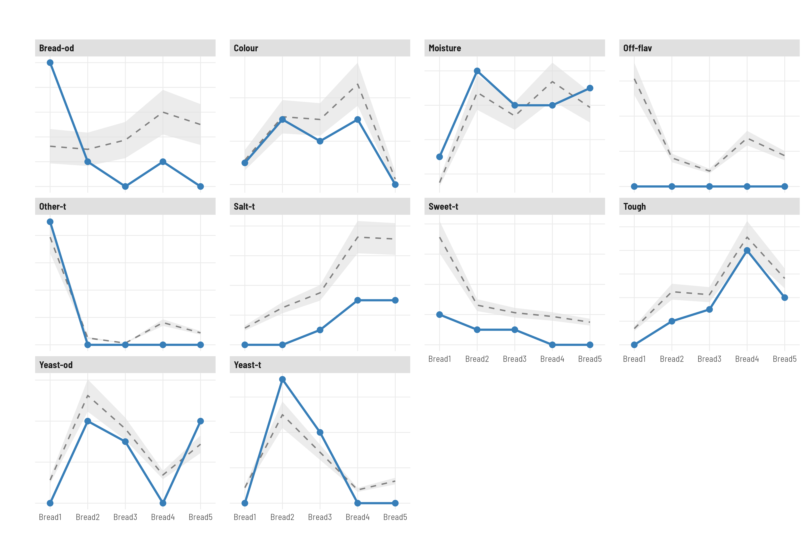
```

## All Assessors Overview

The combined overview plot displays all assessors on a single figure, facilitating rapid identification of outliers or systematic scale deviations.

```{r profile-all, out.width="100%"}
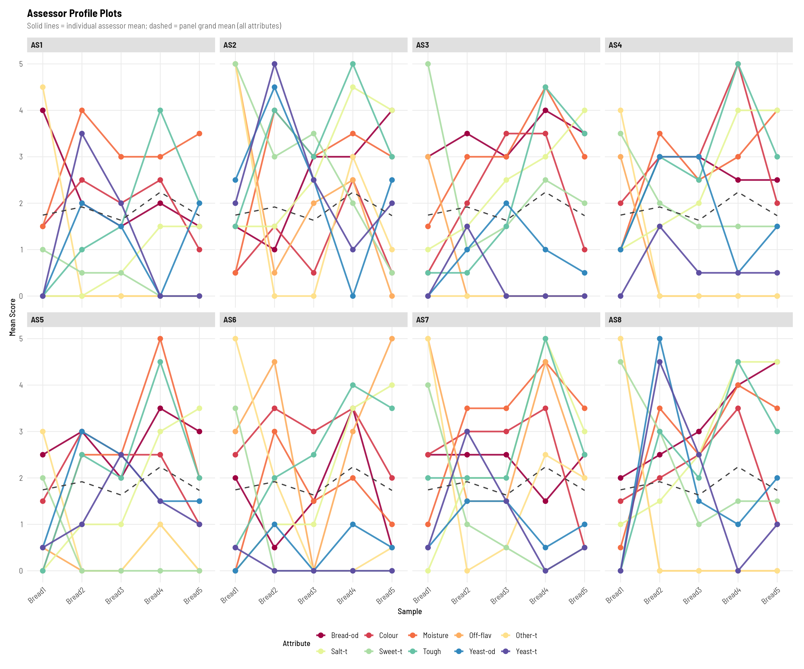
```

## Spider Plot

The spider (radar) chart displays panel mean scores for each sample across all attributes simultaneously, making it straightforward to compare overall sensory profiles between products.

```{r spider, out.width="80%"}
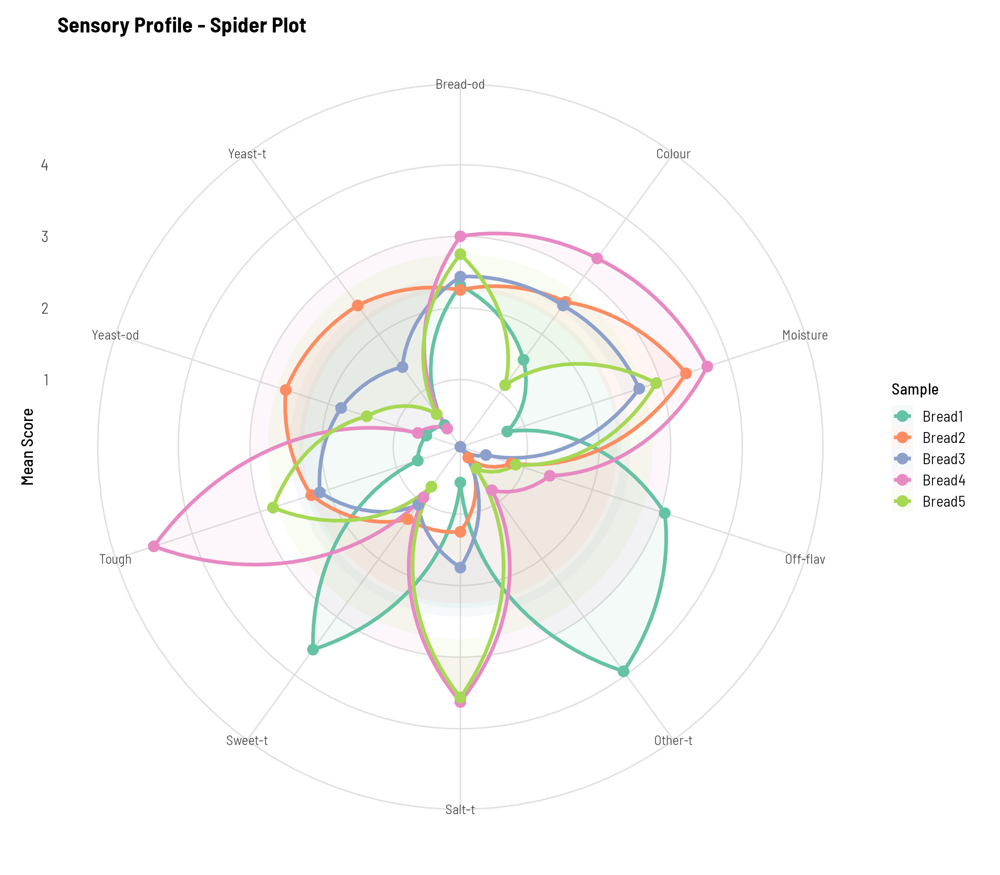
```

---

# Mixed Model ANOVA {.tabset}

A linear mixed model is fitted per attribute using `lmerTest`, with **Sample** as a fixed effect and **Assessor**, **Assessor:Replicate**, and **Assessor:Sample** as random effects. This approach accounts for the hierarchical structure of panel data and provides more accurate inference than a standard ANOVA.

**Model formula:**
```
score ~ Sample + (1 | Assessor) + (1 | Assessor:Replicate) + (1 | Assessor:Sample)
```

## Fixed Effects

The fixed effects table reports the **F-statistic and p-value for the overall Sample effect** per attribute, derived from the mixed model using Satterthwaite denominator df approximation (lmerTest). This is an omnibus test of whether any sample differences exist — it does not identify which specific samples differ (see the Tukey HSD section for pairwise comparisons). A significant result confirms the panel reliably distinguishes between products on that attribute.

```{r mixed-fixed}
tables[["mixed_model_fixed"]] |>
  mutate(across(where(is.numeric), \(x) round(x, 2))) |>
  gt() |>
  tab_header(
    title    = "Table 10. Mixed Model Fixed Effects",
    subtitle = "F-test statistics for the Sample effect per attribute (Satterthwaite df)"
  ) |>
  fmt_number(decimals = 2) |>
  tab_style(
    style = cell_text(weight = "bold"),
    locations = cells_column_labels()
  ) |>
  opt_row_striping() |>
  opt_table_font(font = google_font("Source Sans Pro")) |>
  tab_options(
    table.font.size    = px(13),
    heading.align      = "left"
  )
```

<small>*Significance key:* `***` p < 0.001 · `**` p < 0.01 · `*` p < 0.05 · `ns` p ≥ 0.05</small>

## Random Effects

The random effects table quantifies the variance attributable to each random component (Assessor, Assessor:Replicate, Assessor:Sample, Residual). Large Assessor:Sample variance indicates that panellists disagree on the relative ranking of products.

```{r mixed-random}
tables[["mixed_model_random"]] |>
  mutate(across(where(is.numeric), \(x) round(x, 2))) |>
  datatable(
    filter    = "top",
    rownames  = FALSE,
    extensions = "Buttons",
    options   = list(
      dom        = "Bfrtip",
      buttons    = c("csv", "excel"),
      pageLength = 15,
      scrollX    = TRUE
    ),
    caption = "Table 11. Mixed model random effects variance components per attribute."
  )
```

---

# Post-hoc Analysis — Tukey HSD {.tabset}

Where the mixed model identifies a significant Sample effect, a Tukey HSD post-hoc test is applied to determine which specific sample pairs differ. Compact letter display (CLD) groups are assigned such that samples sharing a letter do not differ significantly at α = 0.05.

## Estimated Marginal Means

Estimated marginal means (EMMs) are model-adjusted sample means that account for imbalance and random effects. They provide the best estimates of true sample differences per attribute.

```{r tukey-emmeans}
tables[["tukey_emmeans"]] |>
  mutate(across(where(is.numeric), \(x) round(x, 2))) |>
  datatable(
    filter    = "top",
    rownames  = FALSE,
    extensions = "Buttons",
    options   = list(
      dom        = "Bfrtip",
      buttons    = c("csv", "excel"),
      pageLength = 15,
      scrollX    = TRUE
    ),
    caption = "Table 12. Estimated marginal means (EMMs) per sample and attribute."
  )
```

## Compact Letter Display

Each row assigns a CLD group letter to a sample–attribute combination. Samples sharing the same letter do not differ significantly; samples with no shared letters are significantly different.

```{r tukey-cld}
tables[["tukey_cld"]] |>
  mutate(across(where(is.numeric), \(x) round(x, 2))) |>
  datatable(
    filter    = "top",
    rownames  = FALSE,
    extensions = "Buttons",
    options   = list(
      dom        = "Bfrtip",
      buttons    = c("csv", "excel"),
      pageLength = 15,
      scrollX    = TRUE
    ),
    caption = "Table 13. Compact letter display (CLD) groups from Tukey HSD."
  )
```

## Pairwise Contrasts

Full pairwise contrast table showing estimated differences, standard errors, t-ratios, and adjusted p-values for every sample pair per attribute.

```{r tukey-contrasts}
tables[["tukey_contrasts"]] |>
  mutate(across(where(is.numeric), \(x) round(x, 2))) |>
  datatable(
    filter    = "top",
    rownames  = FALSE,
    extensions = "Buttons",
    options   = list(
      dom        = "Bfrtip",
      buttons    = c("csv", "excel"),
      pageLength = 15,
      scrollX    = TRUE
    ),
    caption = "Table 14. Tukey HSD pairwise contrasts per attribute."
  )
```

<small>*Significance key:* `***` p < 0.001 · `**` p < 0.01 · `*` p < 0.05 · `ns` p ≥ 0.05</small>

## Means & CLD Plot

Points represent estimated marginal means ± 95% confidence intervals. CLD letters appear above each point; samples sharing a letter are not significantly different.

```{r tukey-means, out.width="100%"}
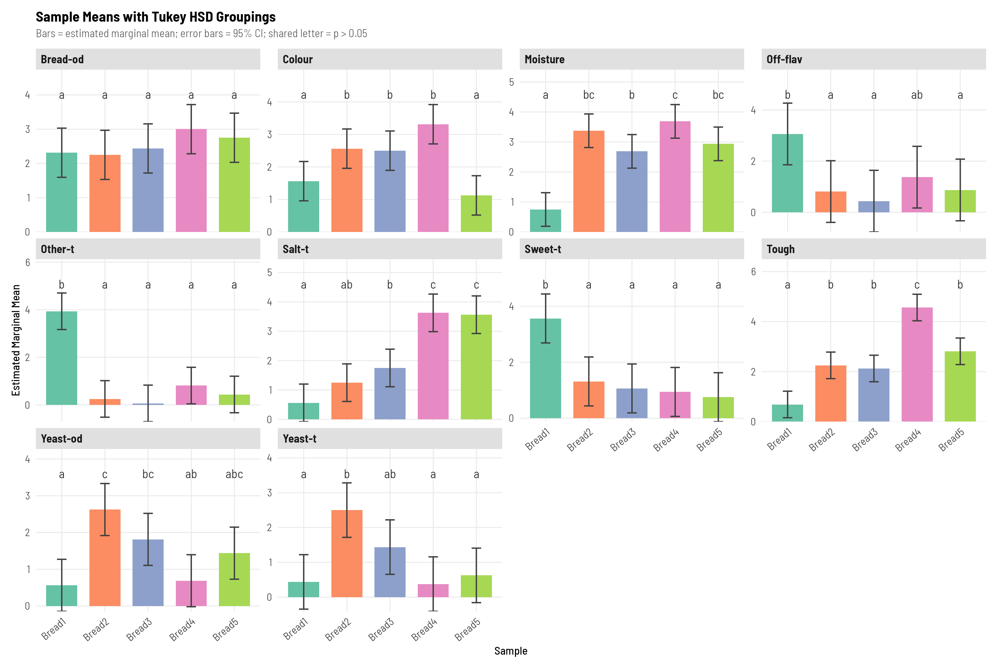
```

## Pairwise P-value Heatmap

The heatmap displays Tukey-adjusted p-values for all pairwise sample comparisons per attribute. Each cell is labelled with a significance symbol; only the lower triangle is shown as comparisons are symmetric.

```{r tukey-heatmap, out.width="90%"}
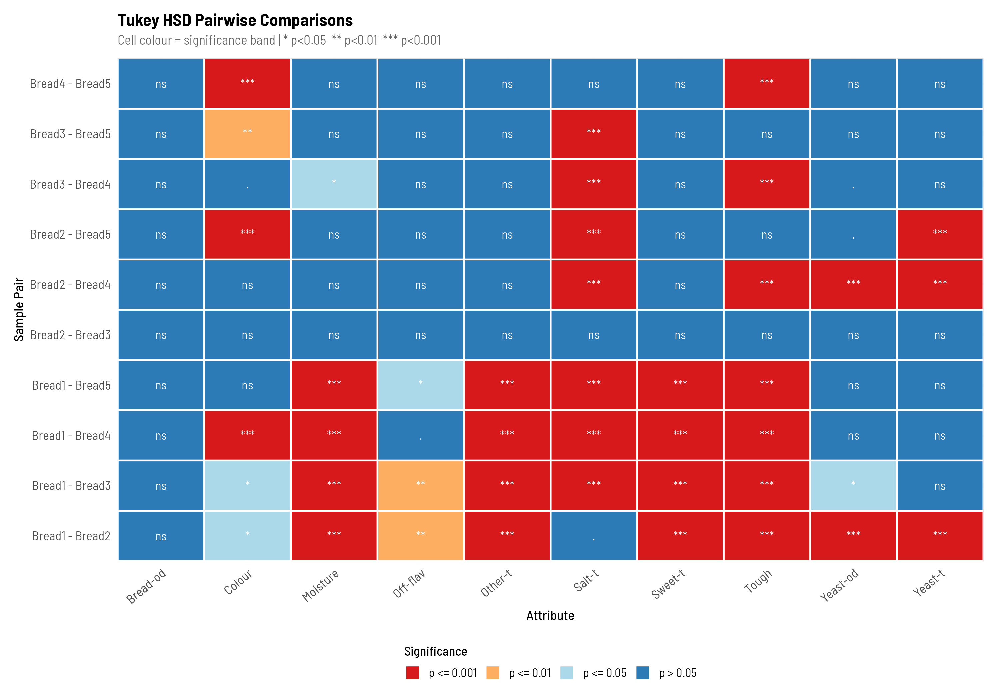
```

---

# Variance Components {.tabset}

## Variance Breakdown Plot

The stacked bar chart partitions total variance per attribute into four sources: **Sample** (product effect), **Assessor** (individual scale use), **Assessor:Sample** (interaction / disagreement), and **Residual** (unexplained error). A large Sample proportion relative to residual error indicates the panel is effectively differentiating between products.

```{r variance-components, out.width="90%"}
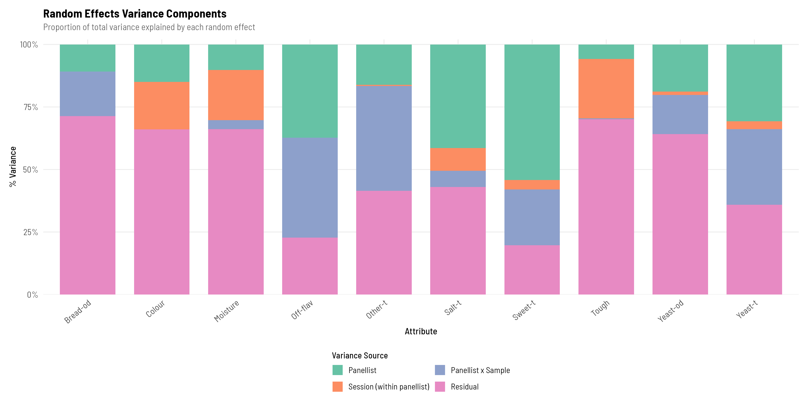
```

---

# Consensus PCA {.tabset}

Principal Component Analysis (PCA) is performed on the **consensus matrix** — the grand mean of all assessor scores per sample and attribute, averaged across replicates. This provides a low-dimensional representation of sample and attribute relationships as perceived by the panel as a whole.

## Biplot

The biplot overlays sample scores (points) and attribute loadings (arrows) in the space defined by the first two principal components. Samples close together are perceived as similar; attributes pointing in the same direction are positively correlated.

```{r pca-biplot, out.width="90%"}
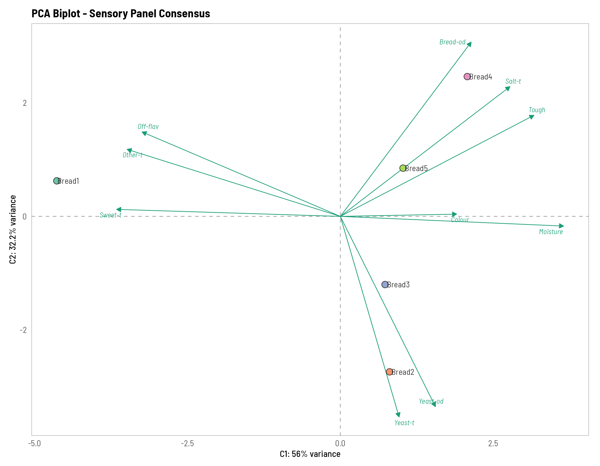
```

## Scree Plot

The scree plot shows the percentage of variance explained by each principal component, along with a cumulative variance line. Components to the left of the elbow are typically retained for interpretation.

```{r pca-scree, out.width="75%"}
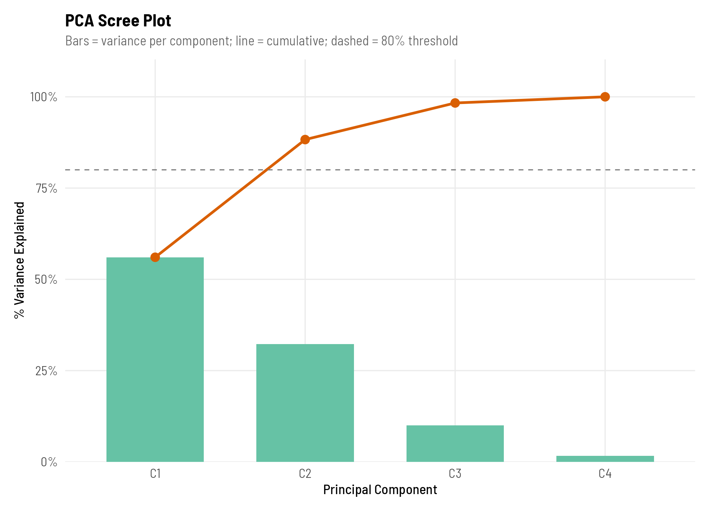
```

## Variable Loadings

Loading bars show the contribution of each sensory attribute to the first two principal components. Longer bars indicate attributes that drive the most variation in the consensus space.

```{r pca-loadings, out.width="90%"}
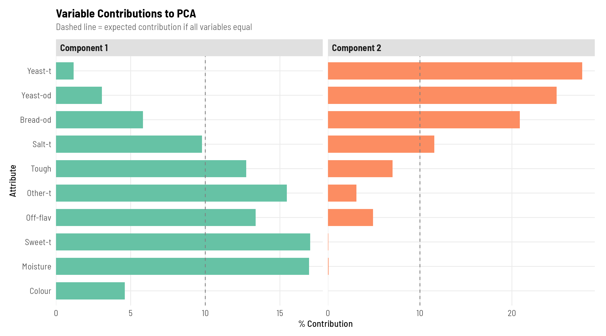
```

## Sample Coordinates

The sample coordinate table reports the PCA scores (position on each component) for every sample. These values correspond to the point positions in the biplot.

```{r pca-samples}
tables[["pca_sample_coords"]] |>
  mutate(across(where(is.numeric), \(x) round(x, 2))) |>
  gt() |>
  tab_header(
    title    = "Table 15. PCA Sample Coordinates",
    subtitle = "Consensus matrix scores projected onto principal components"
  ) |>
  fmt_number(decimals = 2) |>
  tab_style(
    style = cell_text(weight = "bold"),
    locations = cells_column_labels()
  ) |>
  opt_row_striping() |>
  opt_table_font(font = google_font("Source Sans Pro")) |>
  tab_options(
    table.font.size = px(13),
    heading.align   = "left"
  )
```

## Variable Coordinates

The variable coordinate table reports the PCA loadings (contribution of each attribute to each component), corresponding to the arrow endpoints in the biplot.

```{r pca-variables}
tables[["pca_variable_coords"]] |>
  mutate(across(where(is.numeric), \(x) round(x, 2))) |>
  gt() |>
  tab_header(
    title    = "Table 16. PCA Variable Coordinates (Loadings)",
    subtitle = "Sensory attribute contributions to each principal component"
  ) |>
  fmt_number(decimals = 2) |>
  tab_style(
    style = cell_text(weight = "bold"),
    locations = cells_column_labels()
  ) |>
  opt_row_striping() |>
  opt_table_font(font = google_font("Source Sans Pro")) |>
  tab_options(
    table.font.size = px(13),
    heading.align   = "left"
  )
```

---

# Session Information

```{r session-info}
sessionInfo()
```

---

<p class="footer-attr">
Analysis pipeline: <a href="R/run_all.R"><code>R/run_all.R</code></a> · Original PanelCheck application by <a href="https://github.com/CPHFOOD/PanelCheck">CPHFOOD</a> · R translation developed with assistance from <strong>Claude Code</strong> (Anthropic) · <a href="https://github.com/JoshLomax/PanelCheck/tree/feature/r-translation">Get the R script</a>
</p>
